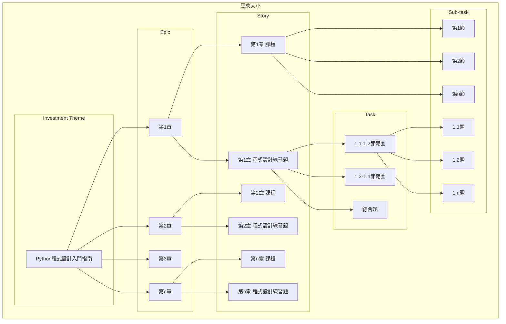

# 《Python程式設計入門指南》學習紀錄
用於紀錄學習《Python程式設計入門指南》的程式範例紀錄，包括加入CI測試、靜態檢查，主要將練習題內容練習完成為目標，所有練習題目程式都會放在 [own_practice](own_practice/)。

```mermaid
graph TD

  subgraph "需求大小"
    subgraph "Investment Theme"
      book["Python程式設計入門指南"]
    end
    subgraph "Epic"

      book --> 1["第1章"]
      book --> 2["第2章"]
      book --> 3["第3章"]
      book --> n["第n章"]
    end
    subgraph "Story"
      1 --> 1-1["第1章 課程"]
      1 --> 1-2["第1章 程式設計練習題"]
      2 --> 2-1["第2章 課程"]
      2 --> 2-2["第2章 程式設計練習題"]
      n --> n-1["第n章 課程"]
      n --> n-2["第n章 程式設計練習題"]

    end
    subgraph "Task"
      1-2 --> 1-2-1["1.1-1.2節範圍"]
      1-2 --> 1-2-2["1.3-1.n節範圍"]
      1-2 --> 1-2-n["綜合題"]
    end
    subgraph "Sub-task"
      1-1 --> 1-1-1["第1節"]
      1-1 --> 1-1-2["第2節"]
      1-1 --> 1-1-n["第n節"]
    end
    subgraph "Sub-task"
      1-2-1 --> 1.1["1.1題"]
      1-2-1 --> 1.2["1.2題"]
      1-2-1 --> 1.n["1.n題"]
    end
  end

```
