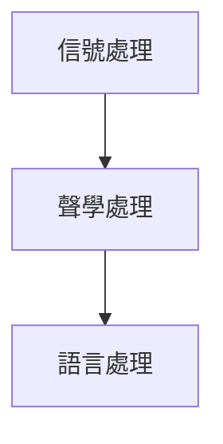

語言的語音辨識有下列步驟與流程，以模組為主的步驟為：

1. 信號處理—語音特徵擷取(Feature Extraction)
    1. 使用示波器測得時域訊號
    1. 快速傅立葉轉換取得頻域訊號
    1. 再抽樣，轉為 MFCC 特徵向量
1. 聲學比對—聲學模型(Acoustic model)
    1. 使用「隱藏馬可夫模型」(HMM, Hidden Markov Model)，依照音素、音節的特徵向量比對找出最大可能的單字，結合「高斯混合模型」(GMM, Gaussian mixture model)，成為經典 GMM-HMM模型
    2. 使用類神經進行訓練來預測最有可能的單字
3. 語言解碼—語言模型(Language Model)
    1. 找出分析的字詞，透過語料庫及語言模型，進行解碼找出可能的詞語與文句

有分成三種：

- https://github.com/pannous/tensorflow-speech-recognition
- https://ithelp.ithome.com.tw/articles/10195970
- https://ictjournal.itri.org.tw/Content/NewsLetter/contents.aspx?MmmID=654304432137072605&MSID=1001007661274742211
- https://yanwei-liu.medium.com/%E4%B8%AD%E6%96%87%E8%AA%9E%E9%9F%B3%E8%BD%89%E6%96%87%E5%AD%97%E6%9C%8D%E5%8B%99-435f323d1794
- https://yanwei-liu.medium.com/%E4%BD%BF%E7%94%A8python%E9%80%B2%E8%A1%8C%E8%AA%9E%E9%9F%B3%E8%BE%A8%E8%AD%98-%E8%81%B2%E9%9F%B3%E8%BD%89%E6%96%87%E5%AD%97-9ab12b750ffe
- https://realpython.com/python-speech-recognition/#working-with-microphones
- https://i3thuan5.github.io/tai5-uan5_gian5-gi2_kang1-ku7/index.html
- http://ielab.ie.nthu.edu.tw/108_IIE_project/3/word/108IIE_proj3_107034703_word.pdf
- https://github.com/nl8590687/ASRT_SpeechRecognition
- https://aclanthology.org/O18-1004.pdf
- http://berlin.csie.ntnu.edu.tw/Courses/2004F-SpeechRecognition/Slides/SP2004F_Lecture06-02_SRILM%20Toolkit.pdf
- https://cmusphinx.github.io/wiki/tutorialconcepts/

- http://www.aclclp.org.tw/corp_c.php
- https://cwn.ling.sinica.edu.tw/
- http://godel.iis.sinica.edu.tw/CKIP/index.htm
- http://asbc.iis.sinica.edu.tw/
- https://www.most.gov.tw/most/attachments/d1670745-fa63-4fc9-af61-e09d6325c5b9
